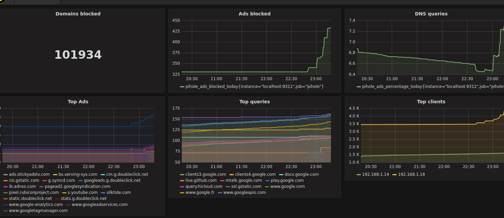

# pihole_exporter

[![License Apache 2][badge-license]](LICENSE)
[](https://badge.fury.io/gh/nlamirault%2Fpihole_exporter)

* Master : [](https://circleci.com/gh/nlamirault/pihole_exporter/tree/master)
* Develop : [](https://circleci.com/gh/nlamirault/pihole_exporter/tree/develop)

Example of available metrics:

```
# HELP pihole_ads_blocked_today Ads blocked today.
# TYPE pihole_ads_blocked_today gauge
pihole_ads_blocked_today 407
# HELP pihole_ads_percentage_today Ads percentage today.
# TYPE pihole_ads_percentage_today gauge
pihole_ads_percentage_today 13.777928
# HELP pihole_dns_queries_today DNS Queries today.
# TYPE pihole_dns_queries_today gauge
pihole_dns_queries_today 2954
# HELP pihole_domains_being_blocked Domains being blocked.
# TYPE pihole_domains_being_blocked gauge
pihole_domains_being_blocked 133209
# HELP pihole_query_types DNS Query types.
# TYPE pihole_query_types gauge
pihole_query_types{type="A"} 0
pihole_query_types{type="AAAA"} 0
pihole_query_types{type="PTR"} 0
pihole_query_types{type="SOA"} 0
```
=======
This Prometheus exporter check your [Pi-Hole](https://pi-hole.net/) statistics. Available metrics are :
* Ads blocked
* Domains blocked
* DNS Queries
* Top Ads
* Top Queries
* Top clients





## Installation

You can download the binaries :

* Architecture i386 [ [linux](https://bintray.com/artifact/download/nlamirault/oss/pihole_exporter-0.2.0_linux_386) / [darwin](https://bintray.com/artifact/download/nlamirault/oss/pihole_exporter-0.2.0_darwin_386) / [freebsd](https://bintray.com/artifact/download/nlamirault/oss/pihole_exporter-0.2.0_freebsd_386) / [netbsd](https://bintray.com/artifact/download/nlamirault/oss/pihole_exporter-0.2.0_netbsd_386) / [openbsd](https://bintray.com/artifact/download/nlamirault/oss/pihole_exporter-0.2.0_openbsd_386) / [windows](https://bintray.com/artifact/download/nlamirault/oss/pihole_exporter-0.2.0_windows_386.exe) ]
* Architecture amd64 [ [linux](https://bintray.com/artifact/download/nlamirault/oss/pihole_exporter-0.2.0_linux_amd64) / [darwin](https://bintray.com/artifact/download/nlamirault/oss/pihole_exporter-0.2.0_darwin_amd64) / [freebsd](https://bintray.com/artifact/download/nlamirault/oss/pihole_exporter-0.2.0_freebsd_amd64) / [netbsd](https://bintray.com/artifact/download/nlamirault/oss/pihole_exporter-0.2.0_netbsd_amd64) / [openbsd](https://bintray.com/artifact/download/nlamirault/oss/pihole_exporter-0.2.0_openbsd_amd64) / [windows](https://bintray.com/artifact/download/nlamirault/oss/pihole_exporter-0.2.0_windows_amd64.exe) ]
* Architecture arm [ [linux](https://bintray.com/artifact/download/nlamirault/oss/pihole_exporter-0.2.0_linux_arm) / [freebsd](https://bintray.com/artifact/download/nlamirault/oss/pihole_exporter-0.2.0_freebsd_arm) / [netbsd](https://bintray.com/artifact/download/nlamirault/oss/pihole_exporter-0.2.0_netbsd_arm) ]


## Usage

Launch the Prometheus exporter :

    $ pihole_exporter -log.level=debug -pihole http://192.168.1.227


## Development

* Build tool :

        $ make build

* Launch unit tests :

        $ make test


## Local Deployment

* Launch Prometheus using the configuration file in this repository:

        $ prometheus -config.file=prometheus.yml

* Launch exporter:

        $ pihole_exporter -log.level=debug

* Check that Prometheus find the exporter on `http://localhost:9090/targets`

* Run Grafana and import the dashboard *dashboard.json*:

        $ docker run -d --name=grafana -p 3000:3000 grafana/grafana


## Docker Deployment

* Build Image:

		$ docker build -t pihole-exporter .

* Start Container
		
		$ docker run -d -p 9311:9311 pihole-exporter -pihole http://192.168.1.5


## Contributing

See [CONTRIBUTING](CONTRIBUTING.md).


## License

See [LICENSE](LICENSE) for the complete license.


## Changelog

A [changelog](ChangeLog.md) is available


## Contact

Nicolas Lamirault <nicolas.lamirault@gmail.com>

[badge-license]: https://img.shields.io/badge/license-Apache2-green.svg?style=flat
